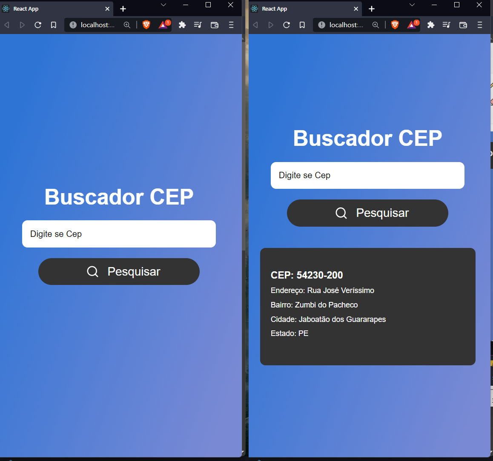

# PROJETO • API de Produtos disponibilizada pelo Carrefour

>  

[Link da aplicação:](https://buscadorcepreact.netlify.app/)  

## :page_facing_up: Explicação

Projeto de um buscador de CEP, onde foi consumido a API do sia viacep.com.

  - API Busca as informações do CEP como: Endereço, Bairro, Cidade e Estado.
      https://viacep.com.br/ws/{cep}/json/

O Projeto foi desenvolvido ultilizando com ReactJs.

Resultados Alcançados:
  - Na Pagina inicial o ususario ao digitar o CEP sera aberto uma janela contendo as informações comom: Endereço, Bairro, Cidade e Estado.

No projeto foram utilizadas as seguintes tecnologias:

- [ReactJs](https://developer.mozilla.org/pt-BR/docs/Web/HTML](https://pt-br.reactjs.org/)

Componentes para ReactJs
- [React-icons](https://developer.mozilla.org/pt-BR/docs/Web/CSS](https://react-icons.github.io/react-icons/)

